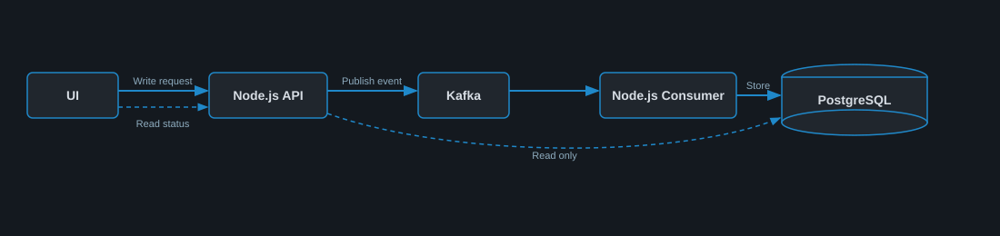

# Well Information Management Platform

This repository contains a direct event-driven workflow for the Well Information Management platform: a .NET validation and Kafka API, a TypeScript consumer, and Node-owned PostgreSQL project storage.

## Documentation

- [Architecture and implementation plan](docs/architecture-and-implementation-plan.md)
- [Initial PostgreSQL schema](database/001_initial_schema.sql)
- [ProjectCreated JSON Schema](contracts/project-created-v1.schema.json)
- [ProjectUpdated JSON Schema](contracts/project-updated-v1.schema.json)
- [ProjectDeleted JSON Schema](contracts/project-deleted-v1.schema.json)
- [OpenAPI 3.1 specification](docs/api/openapi.yaml)

## Basic Flow



```text
Well Information UI
        |
        v
C# API -> Kafka projects.events.v1
        |
        v
Node.js Consumer -> WellInformationDB projects + kafka_consumer_logs
        |
        v
Dashboard query
```

The C# API validates and publishes events but does not write project data to PostgreSQL. The Node.js consumer is the sole project writer. Kafka delivery is at least once, so the consumer uses event IDs and aggregate versions to make processing idempotent.

## Request and Data Flow Guarantees

- **Valid Request:** UI -> C# API -> Validate -> Kafka -> Node.js -> PostgreSQL.
- **Read Data:** UI -> C# Read API -> PostgreSQL -> UI.
- **Invalid Request:** C# validation fails -> Return error -> No Kafka publish or DB write.
- **Kafka Publish Failure:** C# retries -> If still fails, return failure -> Client can safely retry.
- **Consumer Success:** Node.js consumes -> Validates -> Transactional upsert -> Commit Kafka offset.
- **Duplicate or Out-of-Order Event:** Idempotency/version checks prevent incorrect data overwrite.
- **Consumer Failure:** Node.js retries processing -> Continue normally if successful.
- **Poison Message:** After retries fail -> Move message to DLQ -> Consumer continues processing other messages.
- **DLQ Recovery:** Failed messages can be investigated and replayed later.
- **C# Read API Rule:** C# only reads project data from PostgreSQL; it does not write project data.

## System Maintenance Points

- **API Health:** Monitor API availability, liveness/readiness, and failures.
- **Kafka Health:** Monitor broker connectivity, disk usage, and topic health.
- **Kafka Producer:** Handle retries and monitor publish failures.
- **Kafka Consumer:** Monitor consumer status, lag, retries, and offsets.
- **DLQ Monitoring:** Track failed messages and support investigation/replay.
- **PostgreSQL Health:** Monitor database availability, connections, and performance.
- **Data Integrity:** Handle duplicate, out-of-order, and repeated events safely.
- **Error Handling:** Properly handle Kafka, DB, API, and malformed-payload failures.
- **Configuration Management:** Maintain environment-specific configuration through `.env`.
- **Logging and Tracing:** Use proper logs and correlation IDs to trace UI -> C# -> Kafka -> Node.js -> DB.

## Prerequisites

- .NET SDK 10.0.302 or a compatible patch
- Node.js 20 or later
- Docker Desktop with Linux containers

## Build and Test

```powershell
dotnet test .\src\dotnet\WellInformation.sln --configuration Release

Push-Location .\src\node-consumer
npm install
npm run typecheck
npm test
npm run build
Pop-Location
```

## Run the Complete Flow

Create a local environment file from the repository template:

```powershell
Copy-Item .\.env.example .\.env
```

The API and Node consumer both read values from `.env` (or from already-set process environment variables).

Start PostgreSQL and Kafka:

```powershell
docker compose up -d
```

The local stack publishes PostgreSQL on `localhost:15432` and Kafka on `localhost:19093` to avoid common default-port conflicts. The application database is `WellInformationDB`.

In separate terminals, start the API and consumer:

```powershell
dotnet run --project .\src\dotnet\WellInformation.Api --urls http://localhost:5080

Push-Location .\src\node-consumer
npm start
```

Open the project entry screen after both processes are running:

```text
http://localhost:5080
```

Complete the form and select **Create project**. The pipeline confirms C# validation, direct Kafka publication, Node.js consumption, and Node-owned PostgreSQL storage. The created project then appears in the recent projects table.

Connect pgAdmin to the same PostgreSQL server using:

```text
Host: localhost
Port: 15432
Maintenance database: WellInformationDB
Username: postgres
Password: postgres
```

New projects are written by Node.js to `WellInformationDB.public.projects`. Kafka processing records are stored in `WellInformationDB.public.kafka_consumer_logs`.

Create a project:

```powershell
$body = @{
        projectCode = "ONGC-PRJ-001"
        projectName = "Western Offshore Development"
        wellName = "WO-Alpha-01"
        operatorName = "ONGC"
        status = "Draft"
} | ConvertTo-Json

Invoke-RestMethod `
        -Method Post `
        -Uri http://localhost:5080/api/v1/projects `
        -ContentType application/json `
        -Body $body
```

Use the returned `projectId` to verify the Kafka-created dashboard projection:

```powershell
Invoke-RestMethod http://localhost:5080/api/v1/dashboard/projects/<projectId>
```

Update the project with the current ETag version:

```powershell
Invoke-RestMethod `
        -Method Put `
        -Uri http://localhost:5080/api/v1/projects/<projectId> `
        -Headers @{ "If-Match" = '"1"' } `
        -ContentType application/json `
        -Body $updatedBody
```

Soft-delete version 2:

```powershell
Invoke-WebRequest -UseBasicParsing `
        -Method Delete `
        -Uri http://localhost:5080/api/v1/projects/<projectId> `
        -Headers @{ "If-Match" = '"2"' }
```

Run the automated create, update, stale-version, delete, direct-publication, ownership, and DLQ workflow:

```powershell
& .\tests\end-to-end\basic-flow.ps1
```

The API publishes `ProjectCreated`, `ProjectUpdated`, and `ProjectDeleted` directly to Kafka. The Node.js consumer validates each event and stores project data idempotently using event IDs and aggregate versions. C# has read-only access to the Node-owned project table.

The MVP is intentionally unauthenticated for local development. OIDC authorization, `ProjectWorkflow`, and production deployment/monitoring remain future enhancements.