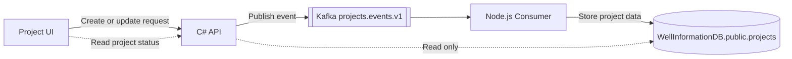

# Well Information Management Platform

## Implemented Direct-Kafka Architecture

Status: Implemented and end-to-end verified  
Database: `WellInformationDB`  
Kafka topic: `projects.events.v1`  
Database writer: Node.js consumer only

## Workflow (Simple View)

1. The UI sends a request to the C# API.
2. The C# API validates and publishes an event to Kafka.
3. The Node.js consumer reads the event and writes the project data to PostgreSQL.
4. The UI reads the latest project status from the API.

Invalid requests return `HTTP 400`. Failed or malformed events are handled by consumer retry and DLQ handling.

## Offsets And Partitions (Simple Explanation)

- `projects.events.v1` has 1 partition.
- `projects.events.v1.dlq` has 1 partition.
- `__consumer_offsets` is a Kafka internal topic used to store consumer positions (offsets). It has many partitions by Kafka default and is not business workflow complexity.

For this project, only the two application topics are part of the business flow:

1. `projects.events.v1`
2. `projects.events.v1.dlq`

Why partitions exist:

- Partitions allow parallel processing and throughput scaling.
- Message order is guaranteed per key per partition (for example, by `projectId`).

Is high partition count required here:

- No, not strictly required for this MVP.
- With one consumer instance, 1 partition can be enough for simple demos.
- 1 partition is used for this simplified demo setup.

## Component Ownership

| Component | Responsibility | PostgreSQL access |
|---|---|---|
| UI | Collect project fields and display processing state | None |
| C# API | Validate, create event envelopes, publish to Kafka | Read-only project queries |
| Kafka | Durable event transport ordered by project ID | None |
| Node.js | Validate events, retry processing, handle DLQ, enforce idempotency | Sole project writer |
| PostgreSQL | Store Node-owned projects and processing logs | Written only by Node.js |

The application database contains only `public.projects` and `public.kafka_consumer_logs`.

## Event Processing

- `ProjectCreated` inserts the Node-owned project at version 1.
- `ProjectUpdated` updates it only when the event version is newer.
- `ProjectDeleted` soft-deletes it only when the event version is newer.
- Duplicate event IDs are ignored by the consumer log unique constraint.
- Malformed events and events that exhaust five processing attempts go to `projects.events.v1.dlq`.
- Kafka offsets are manually committed after successful processing or DLQ publication.

## Consistency And Failure Behavior

The write workflow is asynchronous and eventually consistent. A successful API response means Kafka acknowledged the event; the Node-owned PostgreSQL row may appear shortly afterward.

This direct-publish architecture intentionally has no transactional outbox. If Kafka is unavailable, the API request fails and nothing is stored. Clients should retry the request. Because an HTTP response can be lost after Kafka acknowledges a message, production clients should supply an idempotency key if exactly-once request behavior is required; the current consumer already protects against duplicate event IDs.

## Runtime

Only these application processes are required:

1. C# API
2. Node.js consumer
3. Kafka and PostgreSQL containers

There is no C# outbox worker in the active solution.

## Acceptance Criteria

The executable test at `tests/end-to-end/basic-flow.ps1` verifies:

- C# database write count remains zero.
- Kafka contains `ProjectCreated`, `ProjectUpdated`, and `ProjectDeleted` in order.
- Node.js creates exactly one project row and three consumer-log rows.
- Stale HTTP versions are rejected.
- Duplicate events are ignored.
- Malformed events are routed to the DLQ.